# WordPress + Next.js Starter Kit for GCP

## Work in progress!

Headless WordPress + Next.js Starter Kit for GCP is for setting up a local project with easy deployment to Google Cloud Platform (GCP)

1.  A WordPress backend that serves its data via the [WP REST API](https://developer.wordpress.org/rest-api/) and [GraphQL](http://graphql.org/), which supports posts, pages, categories, menus, search, and user sign-in.
2.  A sample Next.js frontend fed by the [WP GraphQL API](https://www.wpgraphql.com/).
3.  CloudSQL Proxy to connect to a real GCP SQL database

## Dependencies

- Docker (I'm using 18.09 with compose 1.23 but newer versions should be fine)
- A Google Cloud Platform (GCP) account
- The [gcloud CLI](https://cloud.google.com/sdk/docs/#install_the_latest_cloud_sdk_version)
- Composer (`brew install composer`)

## Before Setting Out

Applications will be running in GCP AppEngine (GAE) with CloudSQL for DB. These services aren't free, but are low cost at low scale.
If it's your first time with GCP, you can start out on GCP with a \$300AUD credit or whatever the value provided for your locale.

This architecture on GAE is well suited to blogs, landing pages and other content driven sites. I wouldn't necessarily recommend this for
sites that require lots of user interaction/authentication or super high/enterprise level load.

**What's inside?**

- An automated installer which bootstraps a core WordPress installation that provides an established, stable REST API.
- A plugin which exposes a newer, in-progress [GraphQL API for WordPress](https://wpgraphql.com/).
- The WordPress plugins you need to set up custom post types and custom fields ([Advanced Custom Fields](https://www.advancedcustomfields.com/) and [Custom Post Type UI](https://wordpress.org/plugins/custom-post-type-ui/)).
- Plugins which expose those custom fields and WordPress menus in the [WP REST API](https://developer.wordpress.org/rest-api/) ([ACF to WP API](https://wordpress.org/plugins/acf-to-wp-api/) and [WP-REST-API V2 Menus](https://wordpress.org/plugins/wp-rest-api-v2-menus/)).
- JWT authentication plugins: [JWT WP REST](https://wordpress.org/plugins/jwt-authentication-for-wp-rest-api/) and [JWT WP GraphQL](https://github.com/wp-graphql/wp-graphql-jwt-authentication).
- All the starter WordPress theme code and settings headless requires, including pretty permalinks, CORS `Allow-Origin` headers, and useful logging functions for easy debugging.
- A mechanism for easily importing data from an existing WordPress installation anywhere on the web using [WP Migrate DB Pro](https://deliciousbrains.com/wp-migrate-db-pro/) and its accompanying plugins (license required).
- A sample, starter frontend Next.js app powered by [GraphQL](http://graphql.org/).
- Another sample, starter frontend React app, server-side rendered via [Next.js](https://learnnextjs.com/), powered by WP GraphQL.
- [Docker](https://www.docker.com/) containers and scripts to manage them, for easily running the frontend React apps and backend locally or deploying it to any hosting provider with Docker support.
- CloudSQL Proxy for local connection to your remote SQL database

**What's changed?**

Huge thanks to the team at [Postlight Labs](https://postlight.com) for open sourcing their [original starter](https://github.com/postlight/headless-wp-starter). It was such an excellent starting point, it inspired us to create this fork that's been amended to fit our coding practice at The Royals

- The Next.js application now uses TypeScript instead of plain JavaScript
- The JSON API connection for Next.js has been replaced with GraphQL
- Majority of the components have been rewritten from class style to functional
- The plain React frontend has been removed
- Easy deploy path to GCP

Let's get started.

## Setup GCP and CloudSQL Proxy

A guide on setting up this service can be found [here](https://cloud.google.com/sql/docs/mysql/sql-proxy) and [here](https://cloud.google.com/sql/docs/mysql/quickstart-proxy-test)for reference, however I will be running through
the steps here to cover how it related to me when setting up this specific project

1. [Create a new Project](https://cloud.google.com/resource-manager/docs/creating-managing-projects). If you already have a project to which you'd like to apply this application, this can be skipped of course.

The project name is the context in which we'll be working under for all deployments of the application. In this case I'll call it `nextjs-wp`, the screenshots should reflect this too.

2. Enable the Cloud SQL Admin API

Follow [this link](https://console.cloud.google.com/flows/enableapi?apiid=sqladmin&redirect=https://console.cloud.google.com&_ga=2.18385849.-1683934798.1557445097) and ensure you're in the correct account context

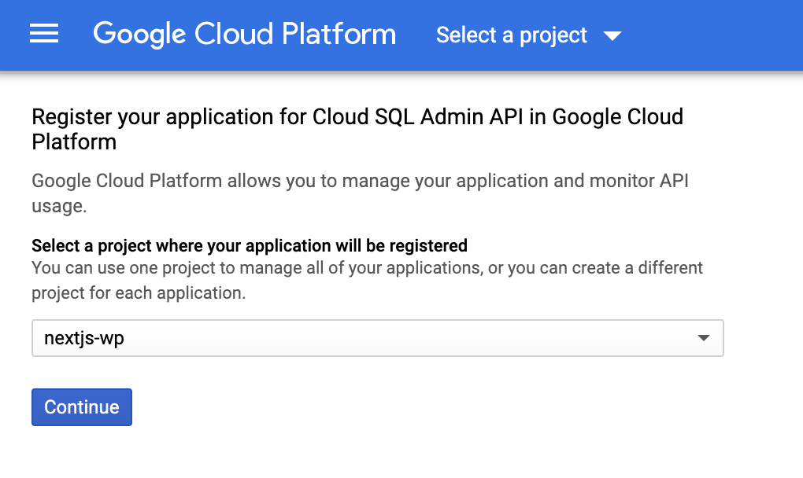

Select the appropriate project and click 'Continue', then 'Continue' again on the next page which returns you to GCP home.

3. Generate and store on the local fs, a set of GCP authentication credentials

Go to the [service accounts page](https://console.cloud.google.com/iam-admin/serviceaccounts/?_ga=2.21211963.-1683934798.1557445097) for GCP and click 'CREATE SERVICE ACCOUNT'
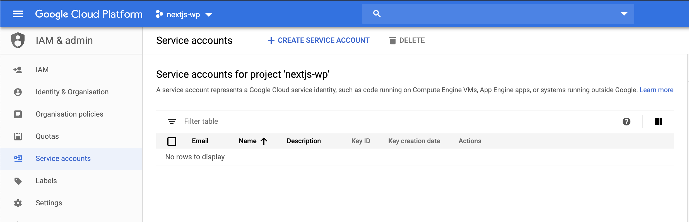

Fill in the form with the appropriate values (note that these credentials should be generated for each user of the proxy service)
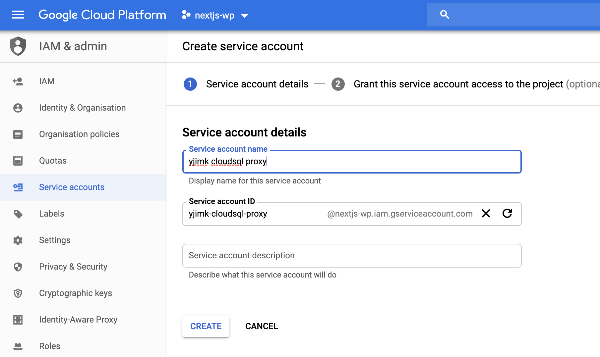

Select one of these roles

- Cloud SQL > Cloud SQL Client
- Cloud SQL > Cloud SQL Editor
- Cloud SQL > Cloud SQL Admin
  For this demonstration, I chose the admin role.

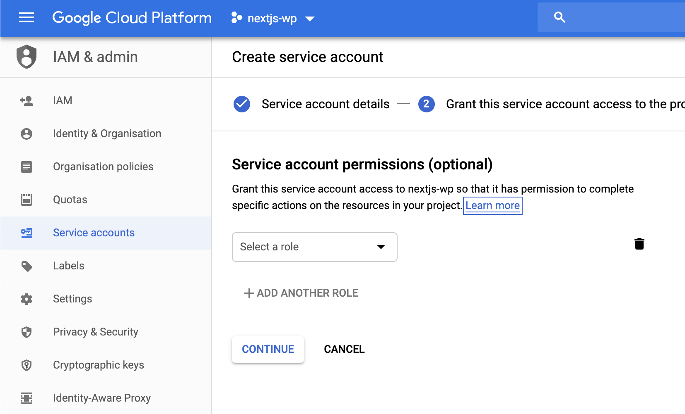

Now let's create and download the key file, and click 'DONE' to finish

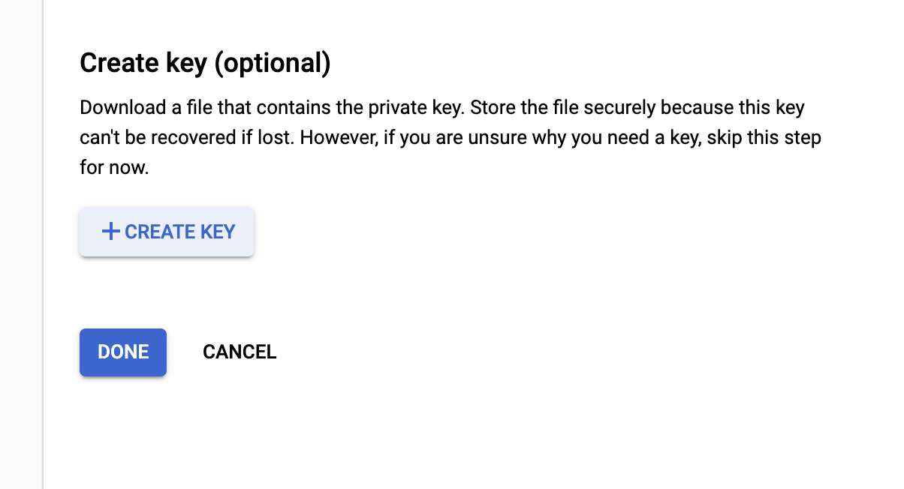
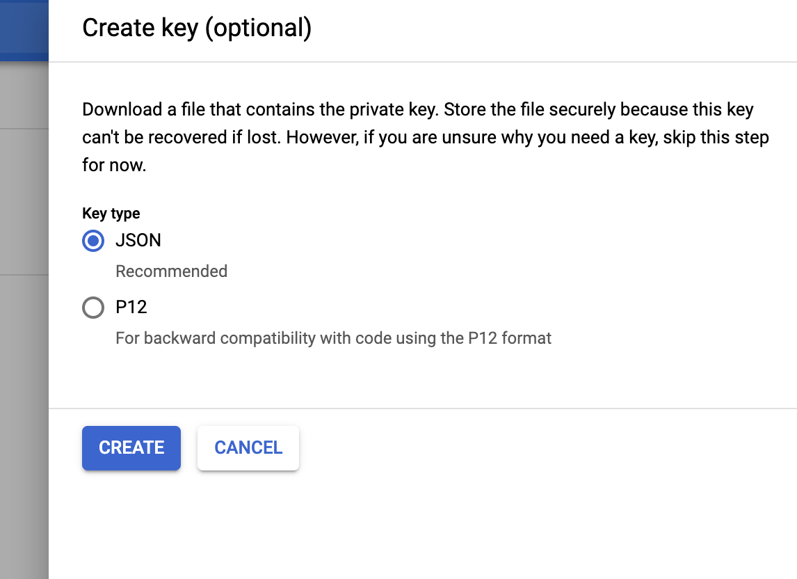

The key should come out as `nextjs-wp-[hash].json`.

We're going to store that in a hidden folder in `~` then mount the folder into the cloud proxy container

`mkdir ~/.gcloud/nextjs-wp`
`mv path-to-downloaded-credentials/nextjs-wp-[hash].json ~/.gcloud/nextjs-wp/nextjs-wp-[hash].json

Finally, you'll need to modify docker-compose.yml to mount and reference the correct directory/file and SQL instance

```yml
cloud-sql-proxy:
  image: gcr.io/cloudsql-docker/gce-proxy:1.14
  command: /cloud_sql_proxy -instances=[project-name]:australia-southeast1:wp=tcp:0.0.0.0:3306 -credential_file=/root/.config/nextjs-wp-[hash].json # Change the credential path, replacing [hash]
  volumes:
    - ~/.gcloud/nextjs-wp:/root/.config # Change the volume mount
  ports:
    - 3306:3306
```

4. Create a new CloudSQL instance

From the GCP main menu, click on 'SQL'. Since this is a new project, you'll see the placeholder screen, click 'Create Instance'

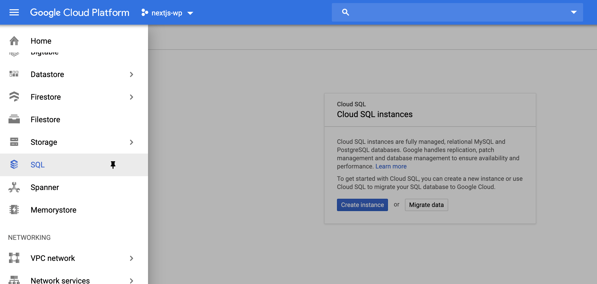

For most WordPress installs, you'll likely want to choose MySQL. PostgreSQL is able to be used with WordPress however I won't cover it in this guide.

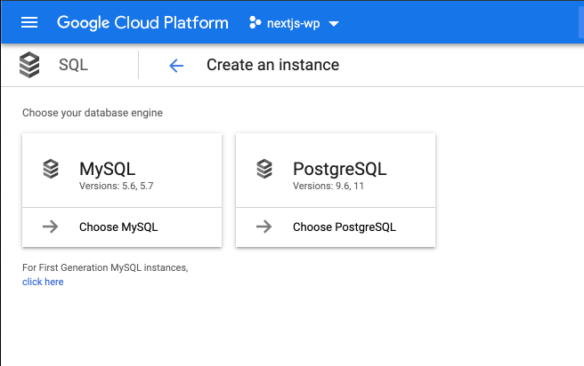

Next, we'll need to configure our CloudSQL instance. For the purpose of this demonstration, I'm going to be opting for the smallest and cheapest option available for the Sydney region.

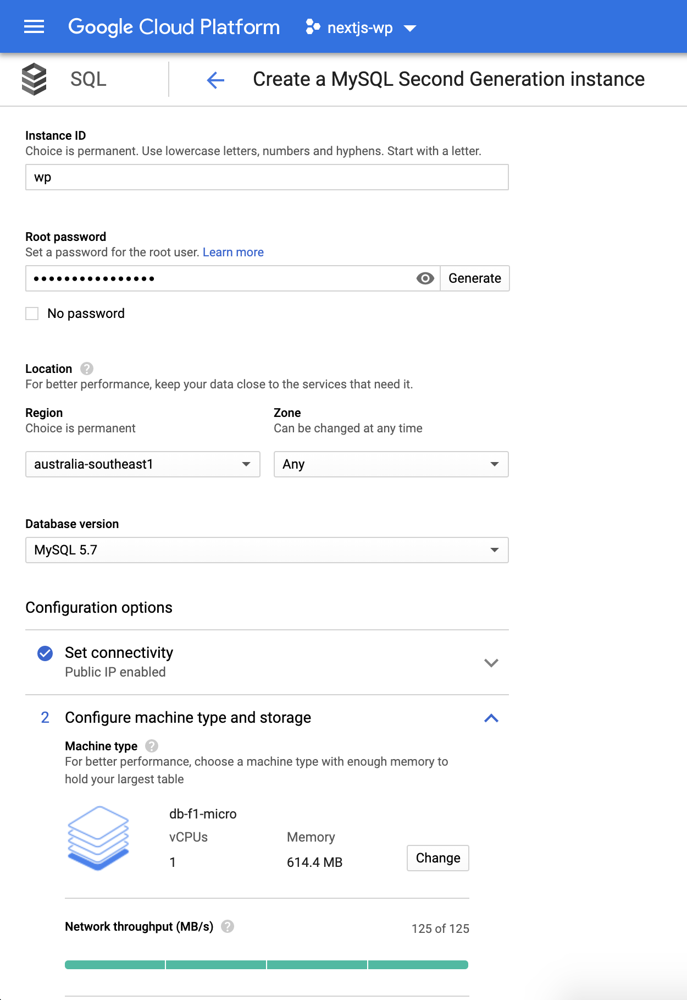

You'll want to tweak these to be suitable for your project. This particular configuration is only around 11USD/month, which is quite cheap considering. Make sure you generate a strong password and keep it secure!

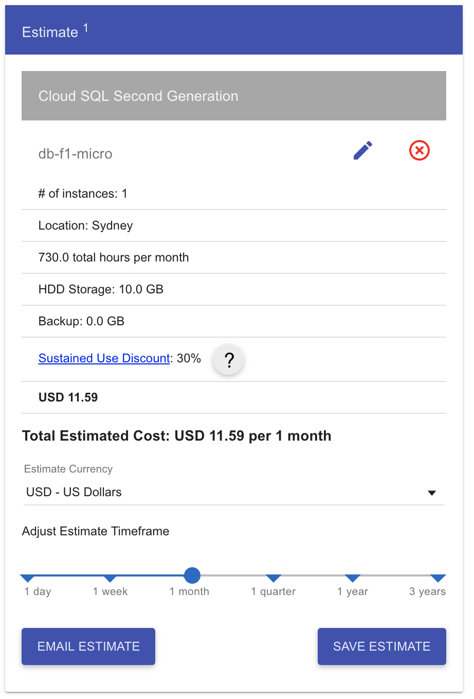

The GCP cost explorer for this can be found [here](https://cloud.google.com/products/calculator/#id=f5dccb8a-b177-4168-9d5e-4c47a66101f4)

Once you're done configuring your new database instance, click 'CREATE INSTANCE' where you'll be brought to this screen. You'll need to wait a bit for the instance to be ready.

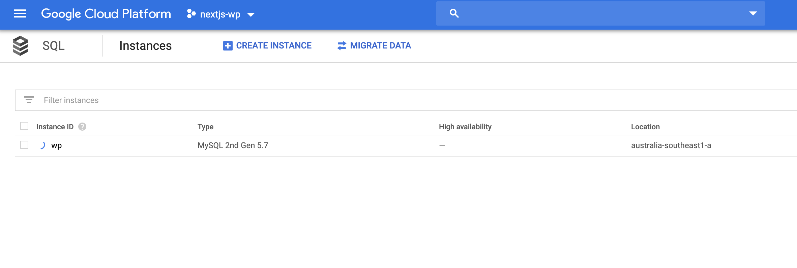

5. Use the CLI to configure CloudSQL for the proxy service

Next, we'll need to create a database on the provisioned database instance. We'll need to jump into the terminal and use the `gcloud` CLI

First auth into your GCP account

```sh
gcloud auth login
```

And set the project context

```sh
gcloud config set project nextjs-wp
```

Now let's create that DB!

```sh
gcloud sql databases create wordpress --instance wp
```

- Note that the instance name is the one we set up when creating our CloudSQL instance in an earlier step.

Generally, you'll want to avoid connecting to any of your instances as root. So let's use the `gcloud` CLI again in order to make a new user and password we can use for connecting through CloudSQL Proxy.

```sh
gcloud sql users create wp_user \
    --host=% \
    --instance wp \
    --password=YOUR_NEW_USERS_PASSWORD # Don't use this password!
```

6. Setup WP for local and GAE environments

Included in this repository is a starter WordPress site and some config files for GAE.

First off, let's move to the `wordpress` directory context

```sh
cd wordpress
```

The required files for a GAE deploy should already be in the sample repository, but for the sake of this exercise, we will regenerate them. It also gives us a chance to set any parameters that might differ in your project compared to the template.

We're going to start by adding our composer dependencies.

```
composer require google/cloud-tools
```

Or if you're using the template, which already has this dependency declared in `composer.json`

```
composer install
```

Generate the required files for GAE and set your configuration

```
php vendor/bin/wp-gae create
```

Or if you have an existing WP project (or the using the template)

```
php vendor/bin/wp-gae update .
```

There is a set of options from this command for linking it to your GCP project. Here are the options I chose for reference

```
Re-using a directory /Users/jcann/www/theroyals/internal-projects/headless-wp-starter-gcp/wordpress/..
Downloading the GCS plugin...
Downloaded GCS plugin.
Please select the region of your Cloud SQL instance (defaults to us-central1)
  [0 ] northamerica-northeast1
  [1 ] us-central
  [2 ] us-central1
  [3 ] us-east1
  [4 ] us-east4
  [5 ] us-west1
  [6 ] us-west2
  [7 ] southamerica-east1
  [8 ] europe-north1
  [9 ] europe-west1
  [10] europe-west2
  [11] europe-west3
  [12] europe-west4
  [13] asia-east1
  [14] asia-northeast1
  [15] asia-south1
  [16] asia-southeast1
  [17] australia-southeast1
 > 17
Using db_region australia-southeast1
Please enter project_id (required): nextjs-wp
Please enter db_instance (required): wp
Please enter db_name (required): wordpress
Please enter db_user (defaults to 'root'): wp_user
Please enter db_password (required):
Do you want to use the same db user and password for local run? (Y/n)
Copied necessary files with parameters.
Your WordPress project has been updated at .
```

This creates the following files

- `app.yaml`: The App Engine configuration file that specifies the runtime and static asset handlers.
- `cron.yaml`: The App Engine configuration file that ensures wp-cron.php is run every 15 minutes.
- `php.ini`: For setting PHP configuration in App Engine specific to WordPress.
- `gae-app.php`: The Front Controller, which is required for all App Engine applications.

It also presents a problem for us (and everyone really) as the setup also edits `wp-config.php` adding the database password in plain text. We really want to keep this secret out of source control, so we'll replace it with an environment variable and load it through `app.yaml` for GAE and our docker-compose file for local from an environment file not kept in source.

Let's add a file to our WordPress project root and call it `.env.yaml`

```yaml
env_variables:
  WORDPRESS_DB_PASSWORD: "YOUR_DB_PASSWORD_HERE"
```

Update our `app.yaml` file to include this config

```yaml
# ...

includes:
  - .env.yaml
```

Make sure to add `.env.yaml` to `.gitignore` to ensure the secrets don't end up in source control!

You'll also need to declare this environment variable in docker to ensure it works correctly.

```yaml
wordpress-522:
  build:
    dockerfile: Dockerfile
    context: ./wordpress
  env_file: ./.env
  ...
```

Finally, we need to update `wp-config.php` to remove the password value as plain text.

```php
$db_pass = ($_ENV["WORDPRESS_DB_PASSWORD"] ?: $_SERVER["WORDPRESS_DB_PASSWORD"]);
...
define('DB_PASSWORD', $db_pass);
```

Note that it appears in (at least) two places, make sure all cases are changed.

Assuming everything has been configured correctly, we can move on to the next phase, installing WordPress on GCP using the CloudSQL Proxy.

## Installing WordPress

_Prerequisite:_ Before you begin this step, you need [Docker](https://www.docker.com) installed. On Linux, you might need to install [docker-compose](https://docs.docker.com/compose/install/#install-compose) separately.

For this template, the WordPress install step has been automated and will run for you when lifting containers for the first time.

The install, such as the username and password, can be configured in the `./.env` file.

```
// Defaults
Username: nedstark
Password: winteriscoming
```

Docker Compose builds and starts three containers by default: `cloud-sql-proxy`, `wordpress-522`, `nextjs-9`:

    docker-compose up -d

**Wait a few minutes** for Docker to build the services for the first time and install WordPress. After the initial build, startup should only take a few seconds.

You can follow the Docker output to see build progress and logs:

    docker-compose logs -f

Once the containers are running, you can visit the Next.js frontend and backend WordPress admin in your browser.

- (Next.js Frontend)[http://localhost:3000]
- (WordPress Admin)[http://localhost:8080/wp-admin]

## Frontend

This starter kit provides one "frontend" container:

- `nextjs-9` container powered by WP GRAPHQL is server-side rendered using Next.js, and exposed on port `3000`: [http://localhost:3000](http://localhost:3000)

You can follow the `yarn start` output by running docker-compose `logs` command followed by the container name. For example:

    docker-compose logs -f nextjs-9

If you need to restart that process, restart the container:

    docker-compose restart nextjs-9

**PS:** Browsing the Next.js frontend in development mode is relatively slow due to the fact that pages are being built on demand. In a production environment, there would be a significant improvement in page load.

## Backend

The `wordpress-522` container exposes Apache on host port `8080`:

- Dashboard: [http://localhost:8080/wp-admin](http://localhost:8080/wp-admin) (default credentials `nedstark`/`winteriscoming`)
- REST API: [http://localhost:8080/wp-json](http://localhost:8080/wp-json)
- GraphQL API: [http://localhost:8080/graphql](http://localhost:8080/graphql)

This container includes some development tools:

    docker exec wordpress-522 composer --help
    docker exec wordpress-522 phpcbf --help
    docker exec wordpress-522 phpcs --help
    docker exec wordpress-522 phpunit --help
    docker exec wordpress-522 wp --info

Apache/PHP logs are available via `docker-compose logs -f wordpress-522`.

## Deployment to GCP

So we already have our database in GCP and a `app.yaml`/`cron.yaml` for WordPress if you followed the previous steps. Now we need to deploy our WordPress and Next.js applications to GCP AppEngine to complete the picture.

**Let's start with the WordPress application.**

Your `wordpress` directory should have a structure a bit like this

```
// Some files/directories omitted for brevity
wordpress
-- wp-admin
-- wp-content
-- wp-includes
-- .env.yaml
-- .gcloudignore
-- app.yaml
-- cron.yaml
-- gae-app.php
-- wp-config.php
```

The only thing that should have required any changes is `wp-config.php` which was also done in the previous step.

Make sure you're working against the correct project context

```sh
gcloud config get-value project
# Your active configuration is: [$ORG_NAME]
# nextjs-wp
```

Time to deploy!

```sh
gcloud app deploy app.yaml cron.yaml
```

Since this is the first time you're deploying the application, AppEngine will ask a few questions about your environment

```
You are creating an app for project [nextjs-wp].
WARNING: Creating an App Engine application for a project is irreversible and the region
cannot be changed. More information about regions is at
<https://cloud.google.com/appengine/docs/locations>.

Please choose the region where you want your App Engine application
located:

 [1] asia-east2    (supports standard and flexible)
 [2] asia-northeast1 (supports standard and flexible)
 [3] asia-northeast2 (supports standard and flexible)
 [4] asia-south1   (supports standard and flexible)
 [5] australia-southeast1 (supports standard and flexible)
 [6] europe-west   (supports standard and flexible)
 [7] europe-west2  (supports standard and flexible)
 [8] europe-west3  (supports standard and flexible)
 [9] europe-west6  (supports standard and flexible)
 [10] northamerica-northeast1 (supports standard and flexible)
 [11] southamerica-east1 (supports standard and flexible)
 [12] us-central    (supports standard and flexible)
 [13] us-east1      (supports standard and flexible)
 [14] us-east4      (supports standard and flexible)
 [15] us-west2      (supports standard and flexible)
 [16] cancel
Please enter your numeric choice:  5

Creating App Engine application in project [nextjs-wp] and region [australia-southeast1]....done.
Services to deploy:

descriptor:      [/headless-wp-starter-gcp/wordpress/app.yaml]
source:          [/headless-wp-starter-gcp/wordpress]
target project:  [nextjs-wp]
target service:  [default]
target version:  [20190716t110146]
target url:      [http://nextjs-wp.appspot.com]


Configurations to update:

descriptor:      [headless-wp-starter-gcp/wordpress/cron.yaml]
type:            [cron jobs]
target project:  [nextjs-wp]


Do you want to continue (Y/n)?  y

Beginning deployment of service [default]...
Created .gcloudignore file. See `gcloud topic gcloudignore` for details.
╔════════════════════════════════════════════════════════════╗
╠═ Uploading 3125 files to Google Cloud Storage             ═╣
╚════════════════════════════════════════════════════════════╝
File upload done.
Updating service [default]...done.
Setting traffic split for service [default]...done.
Deployed service [default] to [http://nextjs-wp.appspot.com]
Updating config [cron]...done.

Cron jobs have been updated.

Visit the Cloud Platform Console Task Queues page to view your queues and cron jobs.
https://console.cloud.google.com/appengine/taskqueues/cron?project=nextjs-wp


You can stream logs from the command line by running:
  $ gcloud app logs tail -s default

To view your application in the web browser run:
  $ gcloud app browse
```

I'd recommend deploying the AppEngine code to the same region as your DB. In this case, `australia-southeast1`

We should now be able to hit our WordPress admin section at http://nextjs-wp.appspot.com/wp-admin! Exciting!

**The last piece of the puzzle is deploying the Next.js application.**

To do this, we're going to use the multi-service AppEngine method.

---

change cron.yaml
set GRAPHQL_ENDPOINT
amend app.yaml `service`
add env and app.yaml files for frontend default
dispatch.yaml
Enable cloud storage plugin

---

## Reinstall

To reinstall WordPress from scratch, run:

    docker exec wordpress-522 wp db reset --yes && docker exec wordpress-522 install_wordpress

**BEWARE** if you're using CloudSQL Proxy, this affects a real database in the cloud. Definitely do not run this against a production database, but also care take of destroying work on staging/dev databases as they may be shared.

## Import Data from Another WordPress Installation

_Note_: This is currently untested, it may not work with CloudSQL.

You can use a plugin called [WP Migrate DB Pro](https://deliciousbrains.com/wp-migrate-db-pro/) to connect to another WordPress installation and import data from it. (A Pro license will be required.)

To do so, first set `MIGRATEDB_LICENSE` & `MIGRATEDB_FROM` in `.env` and recreate containers to enact the changes.

    docker-compose up -d

Then run the import script:

    docker exec wordpress-522 migratedb_import

If you need more advanced functionality check out the available WP-CLI commands:

    docker exec wordpress-522 wp help migratedb

## Extend the REST and GraphQL APIs

At this point you can start setting up custom fields in the WordPress admin, and if necessary, creating [custom REST API endpoints](https://developer.wordpress.org/rest-api/extending-the-rest-api/adding-custom-endpoints/) in the Postlight Headless WordPress Starter theme.

The primary theme code is located in `wordpress/wp-content/themes/theroyals-headless-wp`.

You can also [modify and extend the GraphQL API](https://wpgraphql.com/docs/getting-started/about), An example of creating a Custom Type and registering a Resolver is located in: `wordpress/wp-content/themes/theroyals-headless-wp/inc/graphql`.

## REST & GraphQL JWT Authentication

To give WordPress users the ability to sign in via the frontend app, use something like the [WordPress Salt generator](https://api.wordpress.org/secret-key/1.1/salt/) to generate a secret for JWT, then define it in `wp-config.php`

For the REST API:

    define('JWT_AUTH_SECRET_KEY', 'your-secret-here');

For the GraphQL API:

    define( 'GRAPHQL_JWT_AUTH_SECRET_KEY', 'your-secret-here');

Make sure to read the [JWT REST](https://github.com/Tmeister/wp-api-jwt-auth) and [JWT GraphQL](https://github.com/wp-graphql/wp-graphql-jwt-authentication) documentation for more info.

## Linting

Remember to lint your code as you go.

To lint WordPress theme modifications, you can use [PHP_CodeSniffer](https://github.com/squizlabs/PHP_CodeSniffer) like this:

    docker exec -w /var/www/html/wp-content/themes/theroyals-headless-wp wordpress-522 phpcs

You may also attempt to autofix PHPCS errors:

    docker exec -w /var/www/html/wp-content/themes/theroyals-headless-wp wordpress-522 phpcbf

To lint and format the JavaScript apps, both [Prettier](https://prettier.io/) and [ESLint](https://eslint.org/) configuration files are included.

## Troubleshooting Common Errors

**Breaking Change Alert - Docker**

If you had the project already setup and then updated to a commit newer than `99b4d7b`, you will need to go through the installation process again because the project was migrated to Docker.
You will need to also migrate MySQL data to the new MySQL db container.

**Docker Caching**

In some cases, you need to delete the `wordpress-522` and `frontend` images (not only the container) and rebuild it.

**CORS errors**

If you have deployed your WordPress install and are having CORS issues be sure to update `/wordpress/wp-content/themes/theroyals-headless-wp/inc/frontend-origin.php` with your frontend origin URL.

See anything else you'd like to add here? Please send a pull request!

---

This project won't register as a fork in GitHub, the organisation this was created under _already_ has a fork of the original project from the team at [Postlight](https://postlight.com). Unfortunately you can only have one fork per repo in GH land.

🔬 A project from [The Royals](https://theroyals.com.au). Originally forked from the team at [Postlight](https://postlight.com). Happy coding!
